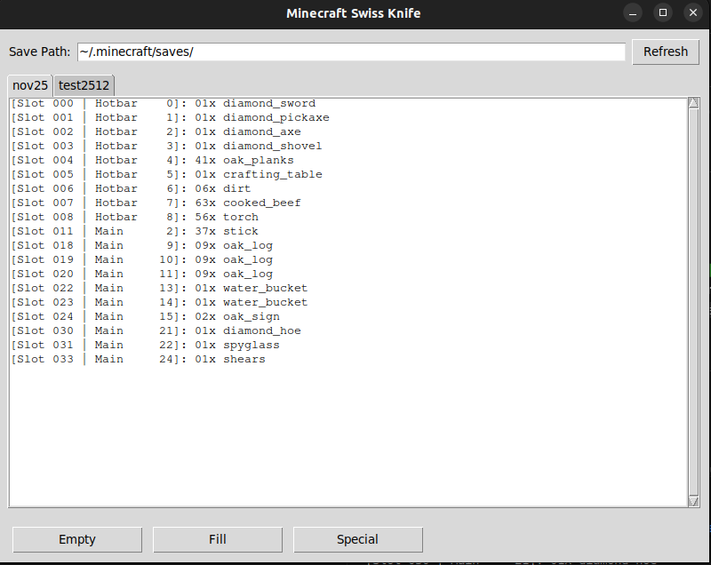

## 👋 Note for Visitors: This is a teaching repository for young learners, not a unicorn project!

# 🎮 Minecraft Swiss Knife

A graphical tool to manage Minecraft save game inventories, player attributes, and datapacks!



## 📋 What This Program Does

This program opens a window where you can:
- ✅ See all your Minecraft save games
- ✅ View the inventory of each save game
- ✅ Fill your inventory with items (Force Fill button)
- ✅ Edit player attributes (health, experience, attack damage, etc.)
- ✅ Manage custom datapacks (install/remove datapacks for your worlds)

## 🎯 Features Overview

### 📦 Inventory Tab
- **View Inventory**: See all items in your player's inventory with slot numbers and quantities
- **Force Fill**: Automatically fill your inventory with useful items

### ⚡ Attributes Tab
- **Edit Player Stats**: Change your player's attributes like:
  - Experience Level (XpLevel)
  - Health and max health
  - Movement speed
  - Attack damage
  - And many more Minecraft attributes!
- **Save Changes**: Apply your modifications to the save file

### 📚 Datapacks Tab
- **View Installed Datapacks**: See which datapacks are active in your world
- **Toggle Datapacks**: Click the checkbox to install or remove datapacks
- **Easy Management**: No need to manually edit world files!

## 🛠️ Installation Instructions

### Step 1: Install Git

**What is Git?** Git is a tool that helps programmers save different versions of their code and work together.

#### On Windows:
1. Download Git from: https://git-scm.com/download/win
2. Run the installer
3. Keep clicking "Next" with default options
4. Done!

#### On Mac:
1. Open Terminal (search for "Terminal" in Spotlight)
2. Type: `git --version` and press Enter
3. If not installed, it will ask you to install it. Click "Install"

#### On Linux:
Open Terminal and type:
```bash
# Debian / Ubuntu
sudo apt-get install git
```

### Step 2: Download This Project

Open Terminal (or Command Prompt on Windows) and type:

```bash
# Go to your Documents folder
cd Documents

# Download the project
git clone https://github.com/pnicorelli/mc_swissknife.git

# Enter the project folder
cd mc_swissknife
```

**What does this do?** `git clone` downloads the entire project to your computer!

### Step 3: Install Python

**What is Python?** Python is the programming language we use to write this program.

#### On Windows:
1. Go to: https://www.python.org/downloads/
2. Download Python (version 3.8 or newer)
3. **IMPORTANT**: When installing, check the box "Add Python to PATH"
4. Click "Install Now"

#### On Linux/Mac:
Probably is already there :P
If not, on Mac `brew install python`
On Linux `sudo apt install python`

To check if Python is installed, open Terminal and type:
```bash
python --version
```

You should see something like: `Python 3.12.0`

### Step 4: Create a Virtual Environment

**What is a virtual environment?** It's like a separate box for your project where you install libraries. This way, different projects don't mix up their libraries!

In Terminal, inside your project folder, type:

```bash
# Create the virtual environment
python -m venv mc_env

# Activate it (Windows)
mc_env\Scripts\activate

# Activate it (Mac/Linux)
source mc_env/bin/activate
```

**How to know it's activated?** You'll see `(mc_env)` at the beginning of your terminal line!

### Step 5: Install Required Libraries

**What are libraries?** They are pieces of code that other people wrote, so we don't have to write everything from scratch!

```bash
# Make sure mc_env is activated (you should see (mc_env) in terminal)
pip install -r requirements.txt
```

**What does this do?** It installs all the libraries listed in `requirements.txt` (like `nbtlib` for reading Minecraft files and `tkinter` for the window).

### Step 6: Run the Program!

```bash
python mc_ui.py
```
A window should open! 🎉

## 🎮 How to Use the Program

### First Time Setup
1. Run the program: `python main.py`
2. The Minecraft path should be automatically detected (`~/.minecraft/saves/`)
3. If not, enter your Minecraft saves path in the top box
4. Click "Scan Worlds" to see your save games

### Managing Your Worlds
1. **Select a World**: Click on a world name in the left sidebar
2. **View Inventory**: The Inventory tab shows all items in your inventory
3. **Force Fill**: Click "Force Fill" to add useful items to your inventory
4. **Edit Attributes**: Go to the Attributes tab to change player stats
5. **Save Changes**: After editing attributes, click "Save Attributes"
6. **Manage Datapacks**: In the Datapacks tab, click checkboxes to install/remove datapacks

### Tips for Beginners
- ⚠️ **Always backup your world before making changes!**
- The program automatically saves when you click "Save Attributes"
- Changes take effect immediately in your save file
- You'll see the changes next time you load the world in Minecraft

**Finding Your Minecraft Saves:**

On Linux, Minecraft saves your worlds in `/home/{myuser}/.minecraft/saves/`. You can change this location in the UI or directly in the code. Linux and Mac have `~` as shortcut for `/home/{myuser}/`

**⚠️ IMPORTANT: Player Data Location**

The player data file is in different places depending on how you play:

- **Single-player games**: `/saves/{worldname}/level.dat`
- **Multiplayer/LAN games**: `/saves/{worldname}/playerdata/{UUID}.dat`

Make sure you're pointing to the correct file type for your game!

## 📂 Project Structure

```
mc_swissknife/
├── main.py                 # Main program file (run this!)
├── core/                   # Core functionality folder
│   ├── mc_player.py        # Functions to read/write player data
│   ├── mc_forcefill.py     # Function to fill inventory
│   └── mc_datapacks.py     # Datapack management
├── utils/                   # Utility modules
│   └── NBTFile.py          # Read/write Minecraft NBT files
├── requirements.txt         # Python libraries needed
└── README.md               # This file!
```

### What Each File Does

- **`core/mc_player.py`** - Functions to read player inventory and attributes from save files
- **`core/mc_forcefill.py`** - Function to automatically fill your inventory with items
- **`core/mc_datapacks.py`** - Functions to add/remove datapacks from worlds
- **`utils/NBTFile.py`** - Handles reading and writing Minecraft's special file format (NBT)
- **`requirements.txt`** - List of Python libraries the program needs

## 📚 Learning Git - Basic Commands

You can use Git from many different apps, I prefer the terminal because I was born thousands of years ago.

Here are the most important Git commands you'll use:

### See What Changed
```bash
git status
```
This shows you which files you modified.

### Save Your Changes

```bash
# Step 1: Add files you want to save
git add .

# Step 2: Save them with a message
git commit -m "Added new feature!"

# Step 3: Upload to GitHub
git push
```

**What's happening?**
- `git add .` = "I want to save ALL the files I changed"
- `git commit` = "Save these changes with a description"
- `git push` = "Upload my changes to GitHub so others can see"

### Download New Changes
```bash
git pull
```
This downloads changes that others made!

### Create Your Own Version (Branch)
```bash
# Create a new branch
git checkout -b my-new-feature

# Work on your code...

# When done, go back to main
git checkout main
```

**Why branches?** You can experiment without breaking the working code!

## 🎓 Understanding Python Basics

### How to Read Python Code

```python
# This is a comment - Python ignores it

# This is a function - it does something
def my_function(parameter):
    result = parameter + 10
    return result

# This calls the function
answer = my_function(5)  # answer will be 15
```

### Important Concepts

**Variables** - Boxes that store values:
```python
player_name = "Steve"
health = 20
```

**Functions** - Recipes that do something:
```python
def add_numbers(a, b):
    return a + b

result = add_numbers(5, 3)  # result is 8
```

**Importing** - Using code from other files:
```python
from core.mc_player import read_player_inventory
```

**Dictionaries** - Collections of key-value pairs:
```python
player_data = {
    "name": "Steve",
    "health": 20,
    "level": 5
}
```

## 🚀 Your Learning Tasks

Here are some fun projects you can try:

### 🟢 Easy Tasks (Beginners):
1. **Change the window title** - Make it say something fun!
2. **Change button colors** - Try different colors for the buttons
3. **Change the window size** - Make it bigger or smaller

### 🟡 Medium Tasks (Getting Comfortable):
1. **Add Empty button** - Implement the empty function on the Inventory Tab
2. **Add Best Equip button** - Implement the Best Equipment function on the Inventory Tab (code exist on `./core/mc_best_equipment.py`)
3. **Add input validation** - Make sure numbers entered on Attributes tab are valid

### 🔴 Hard Tasks (Challenge Yourself):
1. **Add/remove specific items** - Create a UI to add or remove individual items from the Inventory
2. **Undo/Redo functionality** - Keep history of changes and allow undo
3. **Import/Export player data** - Save player data and load it later
4. **Multi-player support** - Handle playerdata folder for multiplayer worlds

### 🎨 Creative Extensions:
1. **Add themes** - Create dark mode and light mode
2. **Add icons** - Use icons instead of text for buttons
3. **Add sounds** - Play a sound when actions are completed
4. **Add more tabs** - Create a new tab with some funny feature

## 📖 Useful Resources

### Python Learning
- **Python Tutorial**: https://www.w3schools.com/python/
- **Python for Kids**: https://www.pythonforbeginners.com/
- **Interactive Python**: https://www.codecademy.com/learn/learn-python-3

### Git Learning
- **Git Tutorial**: https://www.atlassian.com/git/tutorials
- **Git Basics**: https://git-scm.com/book/en/v2/Getting-Started-Git-Basics
- **Try Git**: https://try.github.io/

### GUI Programming
- **Tkinter Tutorial**: https://realpython.com/python-gui-tkinter/
- **Tkinter Examples**: https://www.tutorialspoint.com/python/python_gui_programming.htm

### Minecraft
- **NBT Format**: https://minecraft.wiki/w/NBT_format
- **Minecraft Save Files**: https://minecraft.wiki/w/Java_Edition_level_format
- **Datapacks**: https://minecraft.wiki/w/Data_pack

## 💡 Programming Tips for Beginners

1. **Don't be afraid to break things!** That's how you learn. You can always use `git` to go back.
2. **Read error messages carefully** - They tell you what's wrong and where!
3. **Google is your friend** - Professional programmers Google things ALL THE TIME
4. **Ask questions** - There are no stupid questions in programming
5. **Start small** - Try changing just one thing at a time
6. **Comment your code** - Write notes explaining what your code does
7. **Test often** - Run your program frequently to catch errors early
8. **Take breaks** - Sometimes the solution comes when you're not looking at the screen!

## 🤝 Contributing

When you add a new feature:

1. Create a branch: `git checkout -b my-feature`
2. Write your code
3. Test it thoroughly!
4. Commit: `git commit -m "Added my feature"`
5. Push: `git push origin my-feature`
6. Open a Pull Request on GitHub

## ❓ Common Problems & Solutions

### Installation Issues

**Problem**: "python command not found"
- **Solution**: Make sure you checked "Add to PATH" when installing Python
- **Or try**: Use `python3` instead of `python` (on Mac/Linux)

**Problem**: "No module named 'nbtlib'"
- **Solution**: Activate mc_env and run `pip install -r requirements.txt`
- **Check**: Make sure you see `(mc_env)` in your terminal

**Problem**: "Permission denied"
- **Solution**: On Mac/Linux, you might need different permissions
- **Or**: Make sure the file isn't open in Minecraft

### Program Issues

**Problem**: The window doesn't open
- **Solution**: Make sure you're in the right folder and mc_env is activated
- **Check**: Run `python --version` to verify Python is installed

**Problem**: "Failed to load world data"
- **Solution**: Make sure the Minecraft path is correct
- **Check**: The path should end with `/saves/` or `\saves\`
- **Verify**: The world folder exists and has a `level.dat` file

**Problem**: Changes don't appear in Minecraft
- **Solution**: Make sure Minecraft is closed when you make changes
- **Tip**: Always backup your world first!

**Problem**: Attributes won't save
- **Solution**: Check that you have write permissions for the save folder
- **Check**: Make sure the world isn't being used by Minecraft

### Understanding Errors

**Syntax Error**: You made a typo or forgot something (like a colon or parenthesis)
```python
# Wrong
def my_function()
    print("Hello")

# Right
def my_function():
    print("Hello")
```

**Import Error**: Python can't find a module
- Check the file name is correct
- Make sure the file is in the right folder
- Activate your virtual environment

**Type Error**: You're using the wrong type of data
```python
# Wrong
age = "25"
print(age + 5)  # Can't add string and number

# Right
age = 25
print(age + 5)  # This works!
```

## 🎉 Have Fun!

Programming is like solving puzzles. Sometimes it's frustrating, but when it works, it feels amazing!

**Remember #1**: Every programmer was a beginner once. You can do this! 💪

**Remember #2**: Programmers write code in English - variable names, comments, everything! It's the universal language of code, so let's practice it here together. 🌍

**Remember #3**: The best way to learn is by doing. Try things, break things, fix things, repeat! 🔄

## 🏆 Achievement Ideas

Track your progress with these achievements:

- [ ] ✨ **First Run** - Successfully ran the program
- [ ] 🔧 **First Edit** - Changed something in the code
- [ ] 💾 **First Commit** - Made your first git commit
- [ ] 🎨 **Customizer** - Changed the UI appearance
- [ ] 🛠️ **Feature Creator** - Added a new feature
- [ ] 🐛 **Bug Hunter** - Found and fixed a bug
- [ ] 📚 **Documentation Writer** - Added helpful comments
- [ ] 🤝 **Contributor** - Made a pull request
- [ ] 🎓 **Teacher** - Helped someone else learn

---

**Questions?** If you have an account here open an "Issue" or ask me somewhere in someway! 😊

**Happy Coding!** 🚀✨